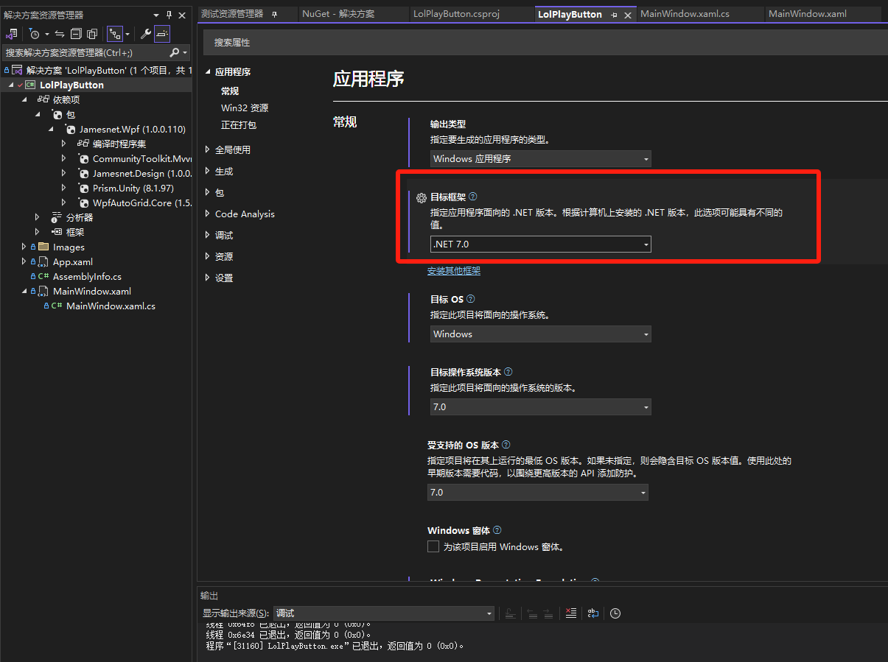
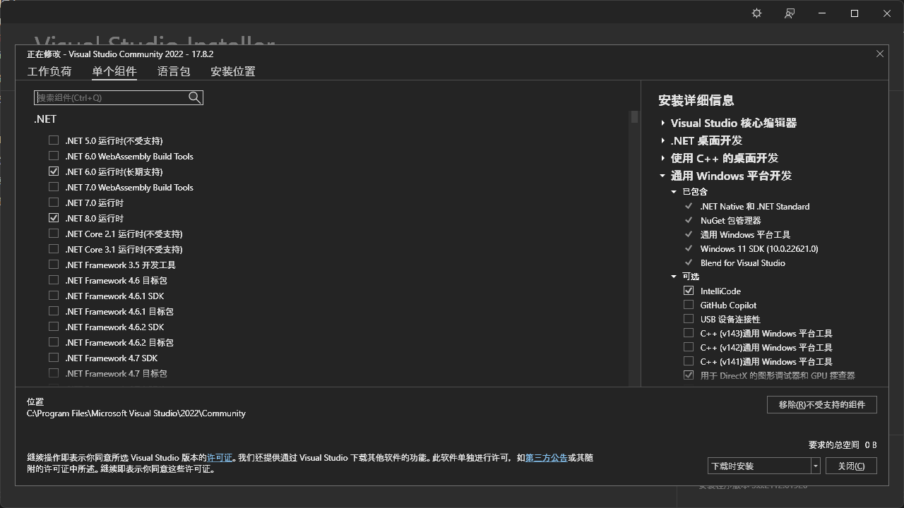

# League of Legends PLAY Button - WPF Project


> Source code from https://github.com/vickyqu115/lol-playbutton
> 
> @vickyqu115 https://github.com/vickyqu115/

在原有`README.md`基础添加了部分初学向wiki

## 运行之前

### ⚙ Development Environment

- **IDE**: Visual Studio 2022
	- **download**: https://dotnet.microsoft.com/zh-cn/download
- **Framework**: .NET 7.0
	- **download** https://dotnet.microsoft.com/zh-cn/download/dotnet
- **Language**: C# 10.0

### 📦 NuGet Package

- Jamesnet.WPF
  - vs打开解决方案资源管理器 - 在解决方案和可用视图之间切换
    - 点击`.sln`结尾的相关解决方案，这里以`LolPlayButton.sln`为例
      - 导航进入`依赖项`-`包`
      - 进入Nuget管理搜索`Jamesnet.WPF`下载
  - 或者：在菜单中选择 "工具" -> NuGet 包管理器

#### Framework

- dotnet.exe

```powershell
>dotnet --list-sdks
6.0.201 [C:\Program Files\dotnet\sdk]
7.0.404 [C:\Program Files\dotnet\sdk]

>dotnet --version
7.0.404

```

- csc <Visual Studio 2022 Developer Command Prompt>

```powershell
>csc
Microsoft(R) Visual C# 编译器 版本 4.8.0-7.23572.1 (7b75981c)
```

## 运行之后

### NETSDK1045

> `NETSDK1045`：当前的 .NET SDK 不支持将“更新的版本”作为目标。

没指定适配的`.net`版本

解决方案资源管理器 - `LolPlayButton` - 右键属性：




### Visual Studio Installer

版本问题打开`Visual Studio Installer` - 修改 - 添加相关版本即可




### 其他

- Visual Studio 2022 Developer Command Prompt

在菜单中选择 "工具" -> "命令提示符" -> "Developer Command Prompt"。

- NuGet 包管理器

在菜单中选择 "工具" -> NuGet 包管理器


## 📄 Project Introduction
This project is a detailed breakdown of the open-source WPF application "League of Legends" game interface we developed a few years ago. Our goal is to dissect the components and extensively showcase the capabilities of WPF. This series is a guide on how to manage WPF projects effectively and efficiently.
#### [Here-Full Project](https://github.com/jamesnet214/leagueoflegends)


### 📝 What You Will Learn:
- Directly drawing special graphics within WPF projects without external design software.
- Exploring the special attributes of Object_Path.
- Managing gradients in WPF.
- Implementing smooth and alternating animations using Jamesnet.WPF NuGet package.

## 🌱 Features
- An extensive series of educational content.
- Step-by-step guidance on advanced WPF techniques.
- Focus on high-level design expressions without dependency on commercial components.

~~## 🎬  Preview Video~~

[//]: # (https://github.com/quyang115/lol-playbutton/assets/52397976/226232a9-a75a-4dcc-b767-156c42c87009~~~~)

## 📷  Project Content Screenshots


